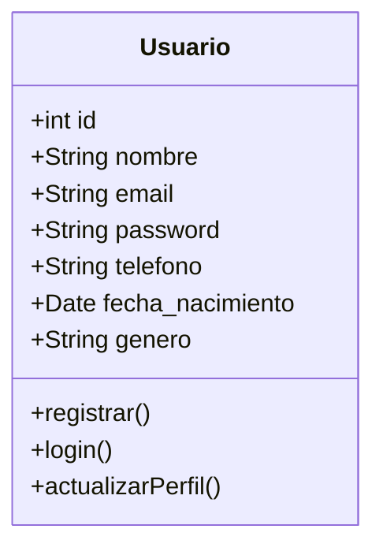
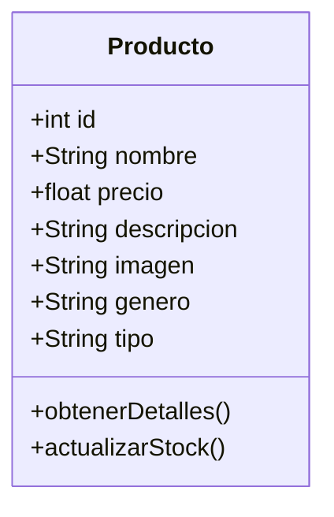
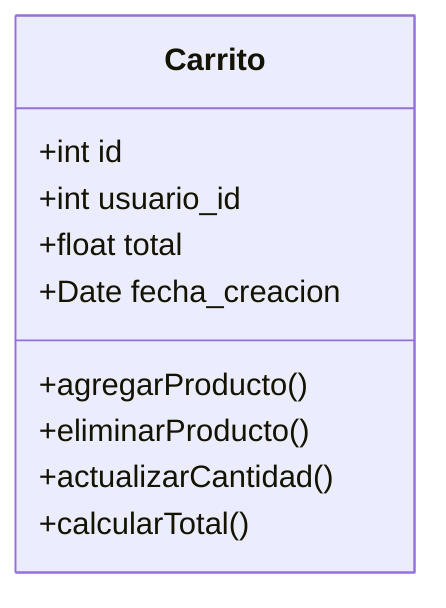
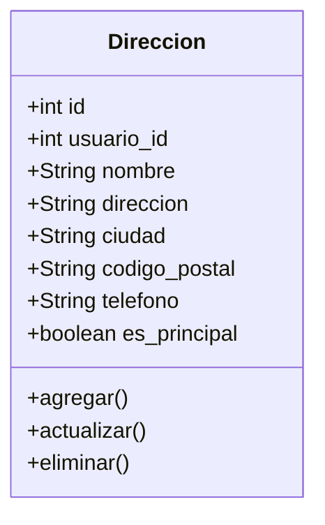
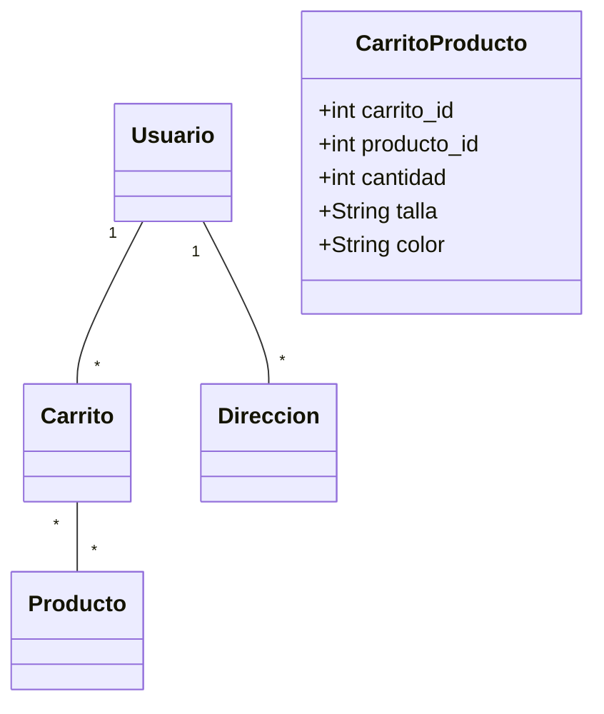
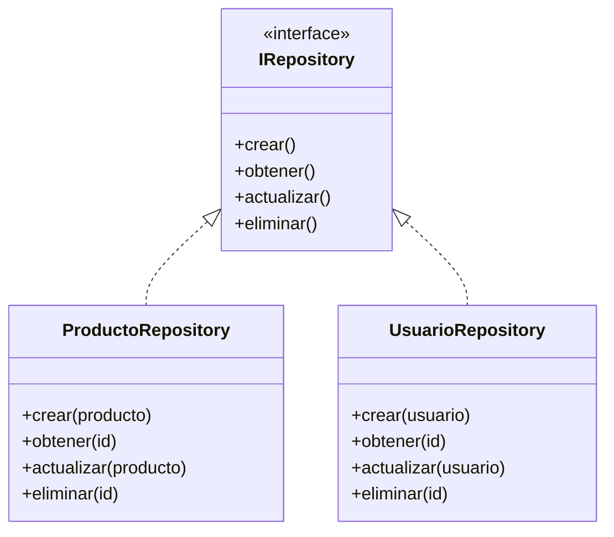
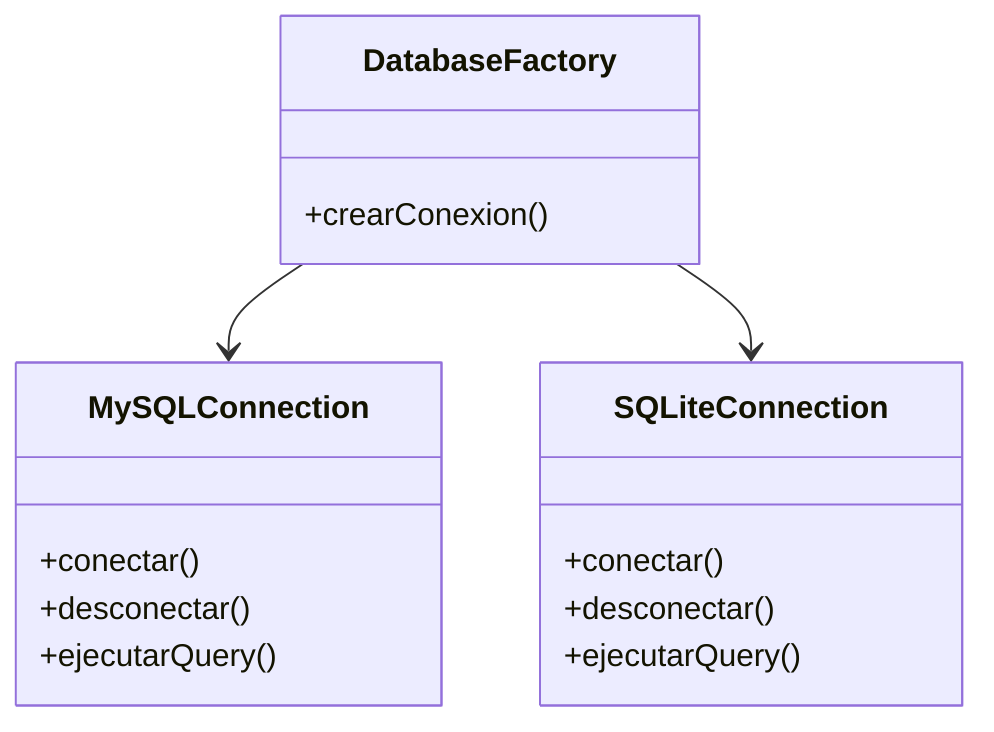

# Diagrama de Clases - Zapatos Moreno

## Entidades Principales

### Usuario

### Producto

### Carrito

### Dirección

## Relaciones

## Patrones de Diseño Implementados

### Repository Pattern

### Factory Pattern
