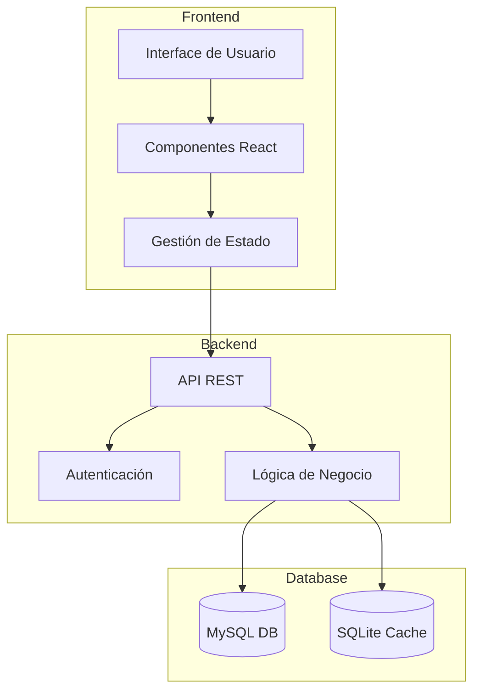
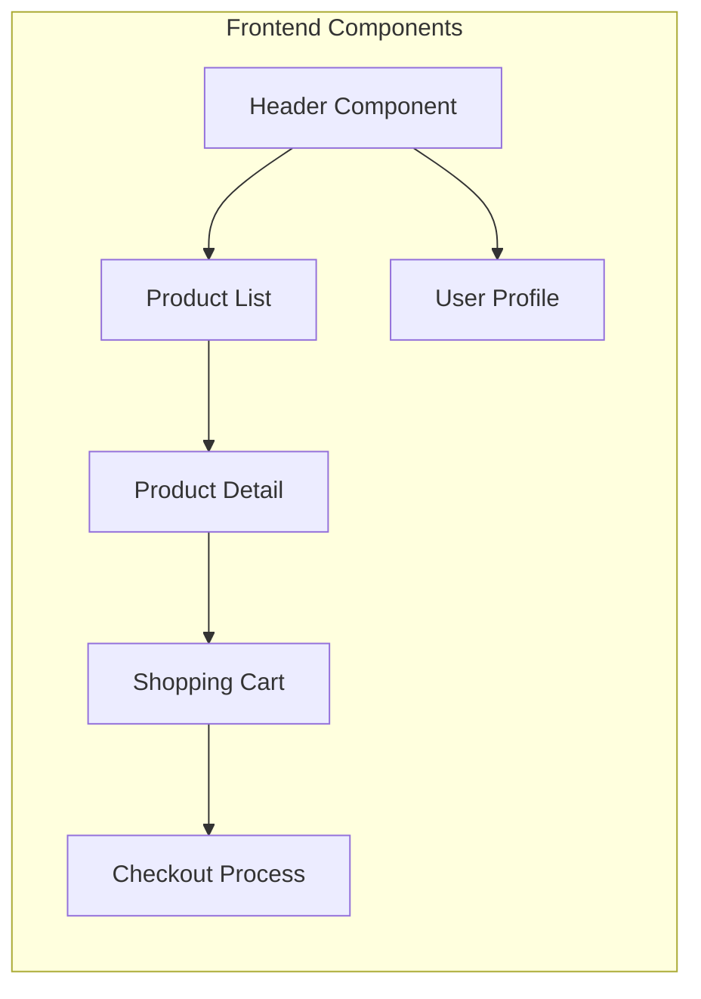
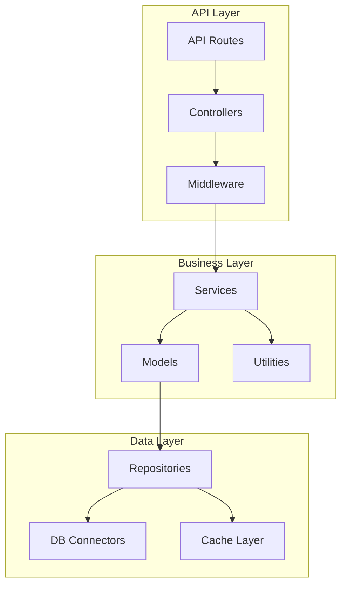
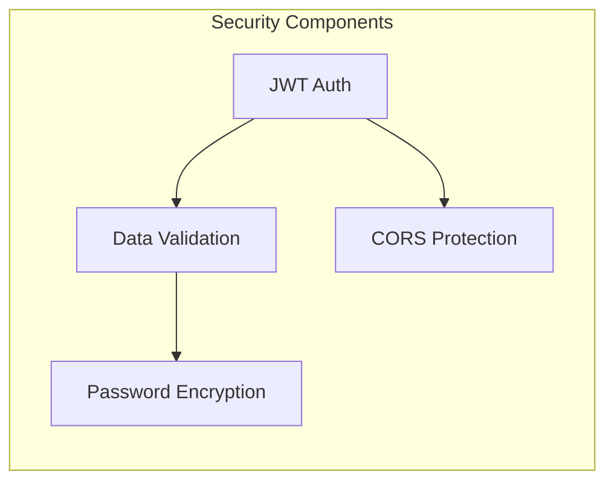
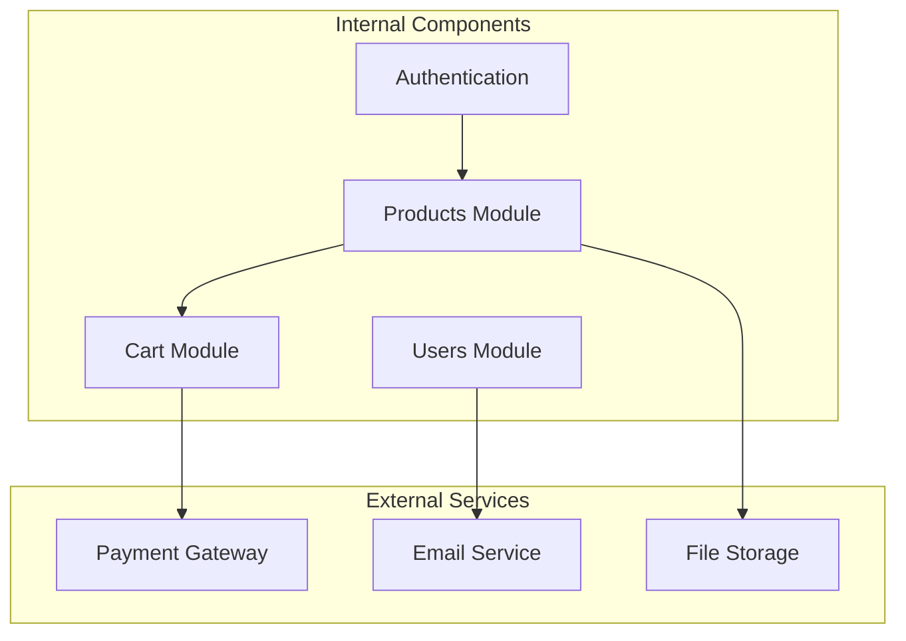
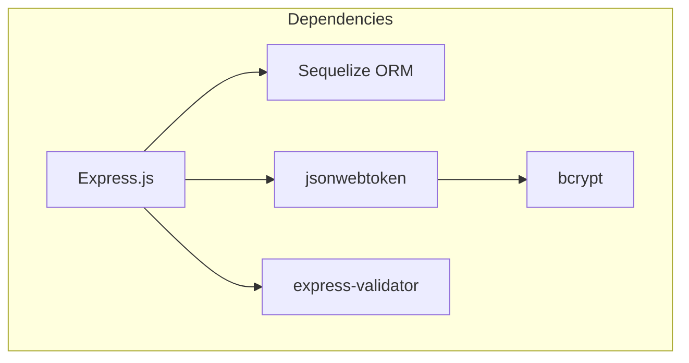

# Diagrama de Componentes - Zapatos Moreno

## Visión General de la Arquitectura

## Componentes del Frontend

## Componentes del Backend

## Componentes de Seguridad

## Integración de Componentes

## Dependencias entre Componentes

